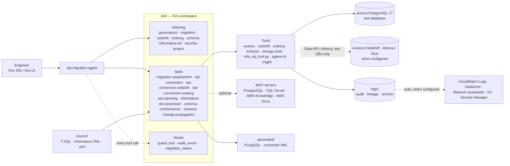
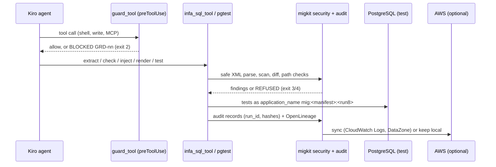

# SQLMigrationProject — SQL Server → Aurora PostgreSQL · Amazon Redshift · Iceberg on S3 with Kiro

Kiro **steering rules**, eight **skills** and a routing **agent** for moving a SQL Server estate to
its approved targets — Aurora PostgreSQL for procedural code, Amazon Redshift for the warehouse,
Apache Iceberg on S3 (Athena / Glue / Spark) for the lake — plus the reports on top, the
Informatica ETL that feeds it, schema gap analysis and governed schema changes. Every conversion
is statically checked, tested or executed on a test target, and packaged with a rule ledger.

| Skill | What it does | Tested by |
|---|---|---|
| `sql-conversion` | T-SQL procedures, functions, triggers, DDL → PL/pgSQL | 17 worked examples, 87 corner cases, 16 hard + 11 parity rules |
| `sql-reporting` | Reporting / analytics SQL on PostgreSQL, Amazon Redshift, Athena (Trino) over Iceberg or Spark SQL (time series, growth, top-N, cohorts, funnels, pivots, subtotals…) | 15 tested report patterns, 24 query rules, 18 dialect rules with Redshift/Athena/Spark examples, `report_tool.py check --target` |
| `informatica-etl-conversion` | PowerCenter XML exports whose SQL targets SQL Server → PostgreSQL, Amazon Redshift or the Iceberg lake (overrides, pre/post SQL, lookups, stored-procedure calls, datatypes, connections; `check --target`, per-target maps) | 5 example mappings (one in real export format), 46 corner cases, 3 public exports round-tripped, `infa_sql_tool.py` |
| `migration-assessment` | Classify and route objects before converting: inventory, M2RVE placement, complexity, review tier, target candidates with blockers, which skill | 12 rules MA, `assess_tool.py` |
| `sql-conversion-redshift` | Tables, BI edge views, set-based loads → Amazon Redshift (design decisions, informational keys, refcursor procedures, MERGE limits, late-binding views, RLS drafts) | 5 worked pairs, 52 corner cases RS, `redshift_tool.py` (+ Redshift Data API on test DBs) |
| `sql-conversion-iceberg` | Tables, loads, Athena views, Glue Spark jobs → Apache Iceberg on S3 (spec types, partition transforms, MERGE safety, job template) | 4 worked examples, 51 corner cases IB, `iceberg_tool.py` (+ Athena on test DBs) |
| `schema-conformance` | Source-vs-target schema snapshots, per-column classification with target profiles, dry-run conformance DDL, reference validation | 22 rules SC, `schema_tool.py` (DDL, live PostgreSQL, Glue catalog) |
| `schema-change-propagation` | Rename/cast templates through the converted flow: cast-before-rename plan, protected layers, token-aware patches, rollback | 20 rules CP, `change_tool.py` |

**Skill map — grouped by migration type and linked to its steering** (`.kiro/steering/governance.md`):

| Group | Target | Standalone SQL objects (views, procedures, functions, triggers, DDL) | SQL embedded in Informatica ETL | Reporting / analytics SQL | Steering |
|---|---|---|---|---|---|
| Assessment (front door) | any | `migration-assessment` | `migration-assessment` | — | `governance.md` |
| Object migration | Aurora PostgreSQL | `sql-conversion` | `informatica-etl-conversion --target postgres` | `sql-reporting --target postgres` | `migration.md`, `informatica-etl.md`, `reporting.md` |
| Object migration | Amazon Redshift | `sql-conversion-redshift` | `informatica-etl-conversion --target redshift` | `sql-reporting --target redshift` | `redshift.md`, `informatica-etl.md`, `reporting.md` |
| Object migration | Iceberg on S3 (Athena / Glue / Spark) | `sql-conversion-iceberg` | `informatica-etl-conversion --target iceberg` (S3 landing + Glue job) | `sql-reporting --target athena` / `--target spark` | `iceberg.md`, `informatica-etl.md`, `reporting.md` |
| Schema governance | any | `schema-conformance`, `schema-change-propagation` | same | read-only snapshots | `schema.md` |

Two agents drive them: **`sql-migration-agent`** (conversion assistant: groups 1 + schema) and
**`sql-reporting-agent`** (reporting SQL assistant), each with a Windows twin — see
[section 7](#7-use-the-agents) and `.kiro/agents/AGENTS.md`. A placeholder MCP server exposes the
read-only tools to other clients ([section 9](#9-mcp-servers-optional)).

A shared **governance layer** (`.kiro/steering/governance.md`, `migkit/contract.py`) gives every
skill the same request/output contract, statuses, stop codes, rule ledger, validation manifest and
package format, and the agent asks the intake questions before choosing a skill.

Around them: **deterministic guardrails** (input scanning for prompt injection, hidden text, secrets
and dangerous SQL; safe XML parsing; Kiro hooks that block credential access, exfiltration, AWS
changes and tampering), a **hash-chained audit log** with one correlation id per run (also visible
in PostgreSQL), **OpenLineage** events for every converted attribute, and optional AWS back ends —
CloudWatch Logs, DataZone, Bedrock Guardrails, S3 Object Lock, Secrets Manager — that fall back to a
local store when not configured or unavailable.

**Status (2026-09-18):** `bash supporting-files/run_tests.sh` → **RESULT: PASS** on Aurora PostgreSQL 17.7
(694 checks, run `6e888b8a…`): project suites, eight skill self-tests (five of them without a
database; Redshift, Athena and Glue paths through a stub AWS CLI; the schema skill also compared
the live Aurora test database), agent hooks and the coverage gate. Every rule, corner case,
security control, logging rule, governance rule and hook guardrail has a tagged test.

> New here? Read the **User Guide**: `docs/SQL_Migration_User_Guide.docx`.

---

## Contents

1. [How it fits together](#1-how-it-fits-together)
2. [Quick start](#2-quick-start)
3. [Skill: sql-conversion](#3-skill-sql-conversion)
4. [Skill: sql-reporting](#4-skill-sql-reporting)
5. [Skill: informatica-etl-conversion](#5-skill-informatica-etl-conversion)
6. [Skills for assessment, Redshift, Iceberg, schema conformance and change propagation](#6-skills-for-assessment-redshift-iceberg-schema-conformance-and-change-propagation)
7. [Use the agents](#7-use-the-agents)
8. [Kiro CLI commands](#8-kiro-cli-commands) — skills, agents, MCP servers
9. [MCP servers (optional)](#9-mcp-servers-optional)
10. [Security, audit, lineage and AWS services](#10-security-audit-lineage-and-aws-services)
11. [Tests](#11-tests)
12. [Reuse the kit in your own project](#12-reuse-the-kit-in-your-own-project)
13. [What was converted here](#13-what-was-converted-here)
14. [Troubleshooting](#14-troubleshooting)
15. [Open items (TODO)](#15-open-items-todo)
16. [Documents](#16-documents)

---

## 1. How it fits together

```
.kiro/
├── steering/
│   ├── migration.md               GENERIC SQL rules (always loaded): type & syntax maps, hard rules
│   │                              [H1–H17], parity rules [P1–P11], checklist, naming
│   ├── informatica-etl.md         GENERIC Informatica rules [IE-1–IE-13]: where SQL lives, invariants,
│   │                              connection/datatype mapping, real export format, manual-review list
│   ├── security.md                GENERIC security/audit rules [S-1–S-11]: untrusted content, secrets,
│   │                              least privilege, AWS read-only, correlation id, audit evidence
│   ├── governance.md              GENERIC governance [G-1–G-10]: contracts, statuses, stop codes, gates, skill routing
│   ├── redshift.md                GENERIC SQL Server → Amazon Redshift rules [R-1–R-15] and type map
│   ├── iceberg.md                 GENERIC SQL Server → Iceberg / Athena / Glue / Spark rules [I-1–I-11] and type map
│   ├── schema.md                  GENERIC schema conformance [S-1–S-9] and change propagation [S-10–S-13] rules
│   └── project.md                 THIS project's values: target cluster, paths, commands
├── skills/
│   ├── sql-conversion/            SKILL.md (10-step procedure) · references/{examples/ (00 schema +
│   │                              17 pairs), corner-cases.md (CC-01..87), mcp-tools.md,
│   │                              unsupported-features.md, security-logging.md (SEC/LOG/SVC),
│   │                              aws-services.md} · scripts/ (shared test engine: pgtest.sh, lib/,
│   │                              check_rule_coverage.py, run_skill_tests.sh; migkit/ = security.py,
│   │                              audit.py, localdb.py, services.py — shared by every skill and hook)
│   ├── sql-reporting/             SKILL.md (7-step procedure) · references/{patterns.md (RQ-01..24,
│   │                              RP-01..15), examples/ (15 report functions)} · scripts/ (fixtures,
│   │                              tests, run_skill_tests.sh)
│   ├── informatica-etl-conversion/ SKILL.md (6-step procedure) · references/{sql-locations.md,
│   │                              corner-cases.md (IC-01..44), examples/ (5 XML pairs + converted
│   │                              SQL folders + params/), corpus/ (public HHS exports)} ·
│   │                              scripts/{infa_sql_tool.py, fixtures, tests (unit + SQL), run_skill_tests.sh}
│   ├── migration-assessment/      SKILL.md · references/placement-matrix.md (MA-01..12) · scripts/assess_tool.py + tests
│   ├── sql-conversion-redshift/   SKILL.md · references/{corner-cases.md (RS-01..70), examples/ (5 pairs + design)} ·
│   │                              scripts/redshift_tool.py + tests
│   ├── sql-conversion-iceberg/    SKILL.md · references/{corner-cases.md (IB-01..80), examples/ (DDL, view, job, spatial)} ·
│   │                              scripts/{iceberg_tool.py, templates/glue_iceberg_merge.py.tmpl} + tests
│   ├── schema-conformance/        SKILL.md · references/conformance-rules.md (SC-01..40) · scripts/schema_tool.py + tests
│   └── schema-change-propagation/ SKILL.md · references/{change-rules.md (CP-01..26), examples/ (template, layers, policy,
│                                  profile, flow/)} · scripts/change_tool.py + tests
├── agents/
│   ├── sql-migration-agent.json   routing agent for all eight skills (+ generated Windows twin)
│   ├── prompts/                   sql-migration-agent.md (router: intake questions, skill table, workflows) ·
│   │                              examples.md (prompts per skill)
│   └── hooks/                     migration_status.py (what is pending) · guard_tool.py (preToolUse
│                                  guardrails GRD-01..12) · audit_event.py (session run id, prompt
│                                  hashes, tool audit, sync) · GUARDRAILS.md · tests/
└── settings/                      mcp.json (optional MCP servers, disabled) ·
                                   migration-services.example.json (optional AWS back ends)

source/      SQL Server input (source/schema/ = T-SQL DDL; source/informatica/ = XML exports)
generated/   converted PostgreSQL (generated/schema.sql = converted DDL; generated/informatica/)
examples/    reference pair for newcomers
tests/       project manifest (test_runner.sql), suites, seed data
metadata/    migration_log.json, test_connection.env, create_agent_user.sql, mcp_config.md
supporting-files/  run_tests.sh (test entry point) · kiro_migrate.sh (headless batch migration: scans inputs,
             one batch run id) · doc-generators/ (make_guide.js, make_reporting_guide.js,
             make_architecture.js, make_deck.js — rebuild the Word and PowerPoint documents)
logs/        audit/ (hash-chained JSONL) · state/ (lineage, guardrail results, session) · archive/
docs/        SQL_Migration_User_Guide.docx · Reporting_Analytics_SQL_User_Guide.docx ·
             Technical_Architecture.docx · Executive_Overview.pptx
```





- **Steering** says *what is correct* (generic, portable).
- **Skills** say *how to do one unit of work and prove it*. They share one PostgreSQL test
  engine (`sql-conversion/scripts/lib`), one governance layer (`migkit/contract.py`) and one
  coverage checker.
- **The agent** asks the intake questions, routes to a skill and packages the result with the
  right tools and permissions.

## 2. Quick start

```bash
brew install postgresql@17 awscli        # psql client + AWS CLI (macOS)
```
```bash
bash supporting-files/run_tests.sh                  # everything, against the Aurora test database
```
```bash
kiro-cli chat --agent sql-migration-agent
```
`--project` runs only the project suites, `--skill` only the eight skill self-tests;
`TEST_TARGET=local PGUSER=postgres bash supporting-files/run_tests.sh` targets a local PostgreSQL 17.

**Windows** (PowerShell 5.1+ or PowerShell 7; Python 3.9+ and the PostgreSQL client on `PATH`):

```bat
supporting-files\run_tests.cmd
```
```bat
kiro-cli chat --agent sql-migration-agent-windows
```

Every `.sh` script has a PowerShell twin (`.ps1`) and a `.cmd` launcher next to it, taking the
same arguments. See [Windows, Linux and macOS](#windows-linux-and-macos) below.

### Windows, Linux and macOS

| Task | Linux / macOS | Windows |
|---|---|---|
| All tests | `bash supporting-files/run_tests.sh` | `supporting-files\run_tests.cmd` |
| Project suites / skill self-tests | `… run_tests.sh --project` · `--skill` | `… run_tests.cmd --project` · `--skill` |
| One skill | `bash .kiro/skills/<skill>/scripts/run_skill_tests.sh` | `.kiro\skills\<skill>\scripts\run_skill_tests.cmd` |
| Test engine | `bash .kiro/skills/sql-conversion/scripts/pgtest.sh <manifest>` | `.kiro\skills\sql-conversion\scripts\pgtest.cmd <manifest> -Results <file>` |
| Batch migration | `bash supporting-files/kiro_migrate.sh` | `supporting-files\kiro_migrate.cmd` |
| Package as zip (includes `.kiro`) | `bash supporting-files/package.sh` | `supporting-files\package.cmd` |
| Agents | `kiro-cli chat --agent sql-migration-agent` · `--agent sql-reporting-agent` | `kiro-cli chat --agent sql-migration-agent-windows` · `--agent sql-reporting-agent-windows` |
| Verify the agents | `bash supporting-files/verify_agents.sh [--smoke]` | `supporting-files\verify_agents.cmd [--smoke]` |
| Windows readiness check | `python3 supporting-files/check_windows_readiness.py` | `python supporting-files\check_windows_readiness.py` |
| Python tools | `python3 .kiro/…/migkit/audit.py tail` | `python .kiro\…\migkit\audit.py tail` |

How portability is kept:
- **Python code** uses only the standard library.
  - File locks use `fcntl` on Linux/macOS and `msvcrt` on Windows.
  - Files are read and written as UTF-8 with fixed line endings, and output is forced to UTF-8.
  - Paths may use `\` or `/`.
  - The guard hook also recognises PowerShell and cmd.exe forms of every blocked action.
- **PowerShell scripts** set `PYTHONUTF8=1` and find `python`, `python3` or `py -3`. They find `psql` on `PATH` or under `C:\Program Files\PostgreSQL\<version>\bin`.
- **`sql-migration-agent-windows.json`** is generated from the main agent by `supporting-files/make_windows_agent.py`. It keeps the same tools, resources, write paths, MCP servers and hooks, and runs `python -X utf8` and `.cmd` commands. A test fails if it drifts.
- **`.gitattributes`** keeps `.sh` files LF and `.cmd`/`.ps1` files CRLF, and never converts Informatica XML or `.prm` files, which are compared byte for byte.
- **Readiness is checked on every run:** `python3 supporting-files/check_windows_readiness.py` (hook rule `HOOK-06`, part of `run_tests.sh`) verifies that every `.sh` has a BOM/CRLF `.ps1` twin and a `.cmd` launcher, that the PowerShell files are syntactically balanced and reference existing files, that hand-written twins run the same tests, catalogs and rule prefixes as their `.sh`, that the generated twins (`make_skill_runners.py`) and Windows agents (`make_windows_agent.py`) are in sync, and that `mcp.json` has a Windows variant (`sqlmigration-kit-windows`, `python -X utf8`) of the kit MCP server.
- **Windows tool lookup:** the Python tools find `psql.exe` and `aws.exe` under `Program Files` when they are not on `PATH` (`migkit.platform_compat.find_executable`), the PowerShell scripts do the same (`Find-MigPsql`), and every test re-executes itself in UTF-8 mode (`python -X utf8`).

### The `.kiro` folder is part of the project

Kiro only reads a folder named exactly `.kiro`. **Do not rename it** (for example to `kiro`).
Kiro would stop loading the steering, skills and agents, and the agents' hook commands, the test scripts
and the packaging script would not find their files. `run_tests`, `kiro_migrate` and `package`
stop with a clear message when `.kiro/` is missing. The leading dot hides the folder by convention
on macOS and Linux, but the files are regular files:
- **macOS Finder:** press `Cmd` + `Shift` + `.` to show hidden folders.
- **Linux file managers:** press `Ctrl` + `H`. In a terminal, use `ls -a`.
- **Windows Explorer:** the folder is visible, because it has no Hidden attribute.

`supporting-files/package.sh` (or `package.cmd`) clears any hidden flag (`chflags nohidden` on macOS,
`attrib -h` on Windows). It writes `dist/<project>-<date>.zip` with `.kiro` included and verifies
that the steering files, every `SKILL.md`, both agents and the settings are inside. Runtime `logs/`
are excluded unless you pass `--include-logs`.

## 3. Skill: sql-conversion

Converts one T-SQL object at a time, faithfully (source bugs preserved and flagged), and
proves it with a tagged test suite. Activates on *convert / migrate / port … T-SQL / SQL
Server … PostgreSQL*, or explicitly with `/sql-conversion`.

```text
/sql-conversion source/usp_CustomerOrders.sql
Convert this T-SQL to PostgreSQL: <paste>
Which corner cases apply to source/usp_X.sql? Do not convert yet.
Review generated/sales_reporting.sql for parity issues
Why was DATEDIFF(month) not converted with AGE()?
```
Details: `.kiro/skills/sql-conversion/SKILL.md`; test it with `bash supporting-files/run_tests.sh --skill`.

## 4. Skill: sql-reporting

Turns a report request into correct, deterministic PostgreSQL SQL delivered as a
`LANGUAGE sql STABLE` function (or view) with hand-checked tests. It pins the spec first
(grain, measure definitions, half-open periods, time zone, ties), picks a pattern, writes
the query and reconciles the numbers before delivering. Activates on *report / dashboard /
KPI / metric / trend / ranking / retention / analytics query*, or `/sql-reporting`.

```text
Monthly revenue for 2025 with empty months shown as 0
Revenue by category with share of total — from order lines
MoM and YoY growth for 2025
Top 3 products per category by units, ties kept
Which customers make 80% of revenue?
Cohort retention by first-purchase month
Checkout funnel for June 2025
Stock on hand at 30 June 2025 (last snapshot, not a sum)
Review this dashboard query for double counting and time-zone bugs: <paste>
```

What it protects you from (each rule has a test — `references/patterns.md`):

| Rule | Silent error it prevents |
|---|---|
| RQ-01 aggregate at the finest grain | header amounts multiplied by line count (4 999 → 8 309) |
| RQ-03/04 NULL-safe, cast-before-divide, round last | `/0` errors, `7/2 = 3`, percentages off by rounding |
| RQ-05/06/07 half-open ranges, gap filling, time zone, week start | last-day rows dropped, missing months, wrong day |
| RQ-08 explicit window frames | running totals merging tied dates |
| RQ-09/10 ranking and percentile choice | tied products dropped; median off |
| RQ-11 growth over a gap-filled series | August compared to June |
| RQ-13 semi-additive measures | stock summed across days |
| RQ-15/16 GROUPING(), deterministic order | subtotals confused with NULLs; rows changing between runs |
| RQ-17/18 cohorts, funnels | wrong denominators; events counted as users |
| RQ-22/23/24 text normalisation, no average of averages, COUNT variants | three "Widgets" groups; 248 vs 333 |

Patterns RP-01..RP-15 (`references/examples/`): revenue by period, category breakdown,
running totals, MoM/YoY, top-N per group, Pareto, distribution stats, pivot, cohort
retention, stock as-of, funnel, gaps & islands, rollup subtotals, first/last per group,
histogram — all run on the sample schema plus a deterministic reporting seed.

Self-test: `bash .kiro/skills/sql-reporting/scripts/run_skill_tests.sh` (88 tests, 23/23
rules, 15/15 patterns).

### Reporting on Redshift, Athena and Spark

The correctness rules and patterns are the same on every engine; `references/dialects.md`
(`RD-01…RD-18`) gives the spelling per engine (gap filling with a recursive CTE on Redshift and
`UNNEST(sequence())` on Athena, `LISTAGG` vs `listagg` vs `array_join(collect_list())`, exact vs
approximate percentiles, `DECIMAL` money, delivery as views / prepared statements / temporary
views…). Worked examples: `references/examples/{redshift,athena,spark}/`; steering
`.kiro/steering/reporting.md`.

```text
Top 10 customers by lifetime value with share of total, on Redshift
Cohort retention by signup month on Athena over the lake tables
```
```bash
python3 .kiro/skills/sql-reporting/scripts/report_tool.py check generated/reports/redshift/v_report_customer_pareto.sql --target redshift   # RD rules + Redshift linter
python3 .kiro/skills/sql-reporting/scripts/report_tool.py toolbox --target athena --need "gap"
```

## 5. Skill: informatica-etl-conversion

Migrates the SQL and database settings embedded in PowerCenter XML exports without touching
the data flow. Activates on *Informatica / PowerCenter / .prm / mapping XML*, or
`/informatica-etl-conversion`. Steering: `.kiro/steering/informatica-etl.md`.

```text
Convert source/informatica/wf_Load_Orders.xml for PostgreSQL
Inventory the SQL in this PowerCenter export and list the manual-review items
Review generated/informatica/wf_x.sql/ against the Informatica corner cases
```

The workflow, driven by `scripts/infa_sql_tool.py`:

```bash
T=.kiro/skills/informatica-etl-conversion/scripts/infa_sql_tool.py
python3 $T extract source/informatica/wf.xml generated/informatica/wf.sql      # SQL → files + manifest
#   … Kiro converts each NN_*.sql file (SQL dialect rules + Informatica invariants) …
python3 $T check   generated/informatica/wf.sql --source-dir generated/informatica/wf.sql
python3 $T inject  source/informatica/wf.xml generated/informatica/wf.sql generated/informatica/wf.postgres.xml --map generated/informatica/pg_map.json
python3 $T render  generated/informatica/wf.sql tests/informatica/wf.rendered.sql --params etl.prm --bindings bindings.json
```

Each command is audited with the run id, and `inject` records an OpenLineage event. Exit code `3`
means a guardrail refused: an unsafe XML construct, a conversion that adds dangerous SQL, an
unsafe parameter value, or a path outside the folder. `manifest.json` → `security` lists
prompt-injection, hidden-text and credential findings in the export.

Covered corner cases (`references/corner-cases.md`, IC-01..44): XML entities and CRLF;
`$$` parameters, `?port?` bindings, `:TU.` references, `{ }` joins and the `ORDER BY … --`
lookup contract; column-count-by-position overrides; Source Filter fragments; `\;` in
Pre/Post SQL and T-SQL batches (`SET NOCOUNT`, `DECLARE`, `UPDATE STATISTICS`, `EXEC`,
`MERGE`, `DBCC`); mapping- vs session-level precedence; reusable transformations; Stored
Procedure transformations; `#temp` tables; hints; `TOP`; case-insensitive `LIKE`; `dbo`
owners; native datatypes; connection subtypes; Bulk load; cascading renames; sorted ports
vs collation; Informatica expressions that must never be converted; **real export format**
(ISO-8859-1 / Windows-1252, CRLF, `NAME ="…"`, `&#xD;&#xA;`, `Lookup Procedure`, writer settings in
`SESSIONEXTENSION`, PowerExchange attribute names, `CRCVALUE`); **security** (billion laughs / XXE /
remote DTDs, prompt injection in `DESCRIPTION` or comments, dangerous constructs introduced by a
conversion, `.prm` value breakout, manifest path traversal); **audit and lineage**.

Verified against the Informatica 10.4/10.5 documentation and 14 real exports from public GitHub
repositories. Three public-domain HHS exports are kept in `references/corpus/` and round-trip
byte for byte on every self-test.

Worked examples (`references/examples/`): `01_orders_incremental` (SQ override + session
Pre/Post SQL), `02_customer_dim` (user-defined join, lookup override, update override,
T-SQL batch → function, MERGE), `03_shipping_procs` (Stored Procedure → SQL transformation,
`?port?` bindings), `04_product_sales_session_override` (reusable lookup, session override
wins, temp table, hints, DBCC), `05_customer_summary_real_export` (Windows-1252 + CRLF export
with a full SQL Server job: CTE + `ROW_NUMBER`, `OUTER APPLY`/`STRING_AGG`, lookup, update override,
`SET NOCOUNT`/`IF OBJECT_ID`/`EXEC` Pre SQL, `UPDATE STATISTICS` + `\;` Post SQL). Each has `NN.sqlserver.xml`, `NN.sql/` (converted, reviewable)
and `NN.postgres.xml` (generated by the tool).

**Targets other than PostgreSQL** (`IC-45`, `IC-46`): the same extraction and injection serve
Amazon Redshift and the Iceberg lake. `check --target redshift` keeps what Redshift supports
(`GETDATE`, `DATEADD`, `TOP`) and runs the Redshift linter on every fragment;
`check --target iceberg` runs the Spark rules; `inject --map params/redshift_map.json` or
`params/iceberg_map.json` sets connection types, owners and datatypes. PowerCenter does not write
Iceberg tables: the mapping lands files on S3 and the Glue MERGE job of `sql-conversion-iceberg`
loads the table (`.kiro/steering/informatica-etl.md`, "Targets other than PostgreSQL").

Self-test: `bash .kiro/skills/informatica-etl-conversion/scripts/run_skill_tests.sh` — unit
tests, regeneration check of the converted XML, static checks, the rendered SQL executed on
PostgreSQL, 44/44 automatable corner cases.

## 6. Skills for assessment, Redshift, Iceberg, schema conformance and change propagation

Five skills added in September 2026 turn the kit from one migration path into a routed
migration platform. They share the governance layer in `migkit/contract.py` (universal
request/output contracts, statuses `GENERATED | PARTIAL | BLOCKED | VALIDATED`, stop codes, rule
ledger, validation manifest `V-001…V-040`, packages with hashes) described in
`.kiro/steering/governance.md`, and the DDL parser in `migkit/ddl.py`. All tools are standard-library
Python, work on Windows, Linux and macOS, are audited under the run id, and never create AWS
resources or touch non-test databases.

| Skill | Activates on | Tool | Catalog / steering |
|---|---|---|---|
| `migration-assessment` | assess, classify, inventory, scope, "which target", "which skill" | `assess_tool.py assess · inventory · validate · questions` | `MA-01..12` · `governance.md` |
| `sql-conversion-redshift` | convert … to Redshift, warehouse, late-binding view, DISTKEY/SORTKEY | `redshift_tool.py convert-ddl · check · ledger · run · package` | `RS-01..70` · `redshift.md` |
| `sql-conversion-iceberg` | Iceberg, S3 Tables, data lake, Athena, Glue, Spark | `iceberg_tool.py ddl · check · job · ledger · run · package` | `IB-01..80` · `iceberg.md` |
| `schema-conformance` | compare schemas, schema gap / drift, does the DDL match, reference check | `schema_tool.py snapshot · compare · conform · refs · package` | `SC-01..40` · `schema.md` |
| `schema-change-propagation` | rename / cast template, column change request, propagate a change | `change_tool.py ingest · validate · plan · patch · scan · package` | `CP-01..26` · `schema.md` |

### migration-assessment — classify before you translate

```text
Assess source/ for a BI migration; the consumer is Power BI and the target is undecided
Which objects in source/ can go to Redshift and which must stay on Aurora?
What is left to migrate?
```
```bash
python3 .kiro/skills/migration-assessment/scripts/assess_tool.py questions
python3 .kiro/skills/migration-assessment/scripts/assess_tool.py assess source --consumer bi --out generated/assessment
python3 .kiro/skills/migration-assessment/scripts/assess_tool.py inventory source     # + audit of metadata/migration_log.json
```
Per object: construct inventory (comments and literals ignored), heavy and security-bearing
constructs, dependencies, role (`LEFT_EDGE | MIDDLE | RIGHT_EDGE | ELIMINATE | REVIEW`), complexity
`L1–L4`, review tier `T1–T3`, target candidates with **blockers** (cursors block Redshift, triggers
block everything but Aurora), the recommended skill, and open questions as stop codes
(`TARGET_DECISION_REQUIRED`, `SECURITY_MAPPING_REQUIRED`). Output: `classification.json` (universal
output contract) and `assessment.md`.

### sql-conversion-redshift — what belongs in a warehouse

```text
Convert source/schema/sales_db_schema.sql to Redshift DDL with the design in metadata/design/redshift.json
Rewrite source/v_CustomerSummary.sql as a Redshift late-binding view; keep the output columns identical
Turn source/usp_LoadCustomerSummary.sql into a Redshift procedure returning rows through a refcursor
```
```bash
T=.kiro/skills/sql-conversion-redshift/scripts/redshift_tool.py
python3 $T convert-ddl source/schema/sales_db_schema.sql --design metadata/design/redshift.json --out generated/redshift/schema.sql --ledger generated/redshift/schema.ledger.json
python3 $T check generated/redshift/v_customer_summary.sql --source source/v_CustomerSummary.sql     # 0 problems required
python3 $T run generated/redshift/v_customer_summary.sql --database dw_test --workgroup-name analytics-dev --evidence run.json   # Data API, test DB only
python3 $T package source/v_CustomerSummary.sql generated/redshift/v_customer_summary.sql --out generated/redshift/pkg/v_customer_summary --evidence run.json
```
Verified Redshift facts drive the rules: `DISTSTYLE`/`SORTKEY` are design decisions (`AUTO`
otherwise, never guessed), PK/UNIQUE/FK are informational, `CHECK` and triggers and table
functions do not exist, `VARCHAR` is sized in bytes, bare `TEXT` becomes `VARCHAR(256)`,
procedures return rows through an `INOUT refcursor`, MERGE has one `WHEN MATCHED` and one `WHEN
NOT MATCHED` and no `WITH`, late-binding views must be fully schema-qualified, identity functions
become RLS/masking policies only after an approved identity mapping. Five worked pairs in
`references/examples/` (`*.sqlserver.sql` → `*.redshift.sql`).

### sql-conversion-iceberg — tables, loads and views on S3

```text
Land dbo.FactSales as an Iceberg table in sales_lake partitioned by day(SaleDate) and bucket(16, CustomerKey)
Generate the Glue MERGE job for customer_summary keyed on customer_key, latest last_sale wins
Write the Athena view for v_CustomerSummary over the lake tables
```
```bash
T=.kiro/skills/sql-conversion-iceberg/scripts/iceberg_tool.py
python3 $T ddl source/schema/sales_db_schema.sql --design metadata/design/iceberg.json --out-dir generated/iceberg   # <name>.athena.sql + <name>.spark.sql
python3 $T job generated/iceberg/load_customer_summary.job.json --out generated/iceberg/load_customer_summary.glue.py  # rendered, compiled, scanned
python3 $T check generated/iceberg/v_customer_summary.athena.sql --dialect athena --source source/v_CustomerSummary.sql
python3 $T run generated/iceberg/schema.athena.sql --database sales_lake_dev --workgroup primary --evidence run.json      # Athena, test DB only
```
Type map by the Iceberg spec (all character types → `string` with the source length in a `COMMENT`,
`DATETIMEOFFSET` → UTC `timestamp`, `GEOGRAPHY` → WKB `binary`), partition transforms only from the
design file, identity/constraints/defaults/computed columns recorded as "applied by the load job",
Glue 5.x PySpark MERGE job from a template (deduplicated source, idempotent, audit counts, no
credentials or identity calls), Athena views for BI, portability warnings (`BY SOURCE`, recursive
CTEs, `QUALIFY`, float division).

### schema-conformance — prove the target schema before loading

```text
Compare source/schema with generated/schema.sql and list every conflict and missing column
Snapshot the test database and tell me whether it matches the converted DDL
Do all objects referenced by generated/*.sql exist in the target schema?
```
```bash
T=.kiro/skills/schema-conformance/scripts/schema_tool.py
python3 $T snapshot source/schema --dialect tsql --out generated/schema/source.snapshot.json
python3 $T snapshot generated/schema.sql --dialect pgsql --out generated/schema/target.snapshot.json     # or --live (test DB) / --glue --database <db>
python3 $T compare generated/schema/source.snapshot.json generated/schema/target.snapshot.json --profile aurora --out generated/schema/compare
python3 $T conform generated/schema/compare/compare.json --source generated/schema/source.snapshot.json --out generated/schema/compare/conform.sql   # dry run
python3 $T refs generated --target generated/schema/target.snapshot.json
```
Every column is `EXACT`, `APPROVED_TRANSFORM` (type allowlist per target profile `aurora |
redshift | iceberg`, naming profile, mapping file), `MISSING_TARGET`, `MISSING_SOURCE`, `CONFLICT`
(unapproved type, narrowing, tightened nullability, key differences on Aurora) or `UNVERIFIED`;
column order is checked for the consumer contract. On this project `source/schema` vs
`generated/schema.sql` is `GENERATED` with 0 conflicts (17 tables, 112 columns) and every
reference in `generated/` resolves.

### schema-change-propagation — renames and casts without breaking the flow

```text
Apply metadata/changes/q3_changes.csv to generated/ as a dry run; protected layers src.* and lookup.*
Show me the cast-safety findings and what needs a reviewer decision
```
```bash
T=.kiro/skills/schema-change-propagation/scripts/change_tool.py
python3 $T ingest metadata/changes/q3_changes.csv --out generated/changes/changes.json
python3 $T plan generated/changes/changes.json --snapshot generated/schema/target.snapshot.json --layers metadata/changes/layers.json --policy metadata/changes/policy.json --profile metadata/changes/profile.json --flow generated --out generated/changes/plan.json
python3 $T patch generated/changes/plan.json --flow generated --out generated/changes/patches      # diff · migration.sql · rollback.sql · residual scan
python3 $T package generated/changes/plan.json --patches generated/changes/patches --out generated/changes/pkg
```
CSV/XLSX templates with checksums; blank datatypes only from an authoritative snapshot
(`METADATA_NOT_FOUND` otherwise); `RENAME_COLLISION` before generation; protected layers never
edited; cast-safety matrix (`SAFE | LOSSY | HIGH_RISK | UNSUPPORTED`) with data-profile evidence and
reviewer dispositions; **cast before rename**; token-aware edits (comments, literals and aliases
of protected objects untouched); residual scan; rollback script; nothing is ever applied
(`PRODUCTION_WRITE_DENIED`, guardrail `GRD-12`).

Self-tests: `bash .kiro/skills/<skill>/scripts/run_skill_tests.sh` (Windows `.cmd`), no database
needed; Redshift, Athena and Glue paths run against the stub AWS CLI, and live when
`REDSHIFT_DATABASE`/`REDSHIFT_WORKGROUP` or `ATHENA_DATABASE` point at test resources.

## 7. Use the agents

Two agents, each with a generated Windows twin (`.kiro/agents/AGENTS.md`):

| Agent | For | Loads | Writes only under |
|---|---|---|---|
| `sql-migration-agent` | **SQL conversion assistant** — assessment, conversion of standalone and Informatica-embedded SQL to Aurora / Redshift / Iceberg, schema conformance, change propagation | all eight skills | `generated/**`, `tests/**`, `metadata/{migration_log.json,design,schema,changes}/`, `source/schema/**`, `source/informatica/**` |
| `sql-reporting-agent` | **Reporting SQL assistant** — report, dashboard, KPI and analytics SQL on PostgreSQL, Redshift, Athena/Iceberg, Spark; dashboard-query reviews | `sql-reporting`, read-only `schema-conformance`, `check`/`run` of the Redshift and Iceberg tools | `generated/reports/**`, `generated/schema/**`, `tests/**` |

Both are tested structurally (`.kiro/agents/hooks/tests/test_agents.py`, rules `AG-01…08`),
validated with `kiro-cli agent validate`, and can be smoke-tested headlessly:
`bash supporting-files/verify_agents.sh [--smoke]` (Windows `supporting-files\verify_agents.cmd`).

`.kiro/agents/sql-migration-agent.json` loads all eight skills (`skill://.kiro/skills/*/SKILL.md`)
and the steering files. Its prompt is a **router**: it asks the intake questions of
`governance.md` (consumer, approved target, consumer contract, metadata, security, load
semantics, test target, review tier), picks the skill, chains assessment → schema snapshot →
conversion → check → evidence → package, and turns every stop code into a question. It
pre-approves only reads, the test commands, the skill tools, the read-only migkit commands, and
writes under `generated/`, `tests/`, `metadata/{migration_log.json,design,schema,changes}/`,
`source/schema/` and `source/informatica/`. Its hooks run outside the model:

| Hook | Script | Does |
|---|---|---|
| `agentSpawn` | `audit_event.py`, `migration_status.py` | new session run id; security notice for suspicious inputs; migration status |
| `userPromptSubmit` | `audit_event.py` | logs prompt length + SHA-256 only; warns on injected content |
| `preToolUse` (`*`) | `guard_tool.py` | **blocks** (exit 2) credential access, exfiltration, destructive commands, tampering with `.kiro/` or logs, AWS changes, non-test databases (also for the Redshift/Athena/Glue tools), installs, trust-all, writes with injection/secrets/critical SQL, applying change patches (`GRD-12`) |
| `postToolUse` (`*`) | `audit_event.py` | redacted tool audit |
| `stop` | `audit_event.py` | `session.stop`, background sync to AWS when configured |

The guard also applies with `--trust-tools`. Rules and tests: `.kiro/agents/hooks/GUARDRAILS.md`.

```bash
kiro-cli agent list                                   # sql-migration-agent, sql-reporting-agent (+ -windows twins) as Workspace agents
kiro-cli chat --agent sql-migration-agent             # conversion assistant
kiro-cli chat --agent sql-reporting-agent             # reporting assistant
kiro-cli chat --no-interactive --agent sql-migration-agent "Migrate everything pending"
kiro-cli chat --no-interactive --agent sql-reporting-agent "Monthly revenue by category for 2025 with YoY growth on PostgreSQL"
bash supporting-files/kiro_migrate.sh                            # headless batch over pending source files
bash supporting-files/verify_agents.sh --smoke                   # validate both agents + one read-only prompt each
```
In the IDE pick **sql-migration-agent** in the agent selector. Example prompts and how each is
routed: `.kiro/agents/prompts/examples.md`. A few:

| You ask | The agent does |
|---|---|
| *"Assess source/ for a BI migration; target undecided"* | `migration-assessment` → candidates and blockers per object, then asks you to choose |
| *"Convert source/usp_X.sql"* (Aurora) | `sql-conversion` → tests → migration log |
| *"Convert source/schema/*.sql to Redshift with metadata/design/redshift.json"* | `sql-conversion-redshift convert-ddl` → `check` → package; `run` on `dw_test` if configured |
| *"Land dbo.FactSales as an Iceberg table partitioned by day(SaleDate)"* | asks for location/catalog if missing → `iceberg_tool.py ddl` → `check` → package |
| *"Compare source/schema with generated/schema.sql"* | `schema-conformance` → `compare.md` with decisions |
| *"Apply metadata/changes/q3.csv to generated/ as a dry run"* | `schema-change-propagation` → plan, diff, migration and rollback scripts |
| *"Monthly revenue by category with YoY growth"* | `sql-reporting` → tested report function (the `sql-reporting-agent` is the dedicated assistant; the migration agent routes there too) |
| *"Top 10 customers by lifetime value with share of total, on Redshift"* (`sql-reporting-agent`) | `sql-reporting` → `v_report_customer_pareto` view + `report_tool.py check --target redshift` |
| *"Convert source/informatica/wf_x.xml"* | `informatica-etl-conversion` |

The agent never guesses a target, a distribution key, a partition, a datatype or an identity
mapping: a missing decision comes back as a question with options.

## 8. Kiro CLI commands

Checked against Kiro CLI 2.21. Terminal commands start with `kiro-cli`; chat commands with `/`.

| Task | Command |
|---|---|
| List loaded skills and steering | in chat: `/context show` |
| Browse skills as slash commands | in chat: type `/` → `/sql-conversion`, `/sql-reporting`, `/informatica-etl-conversion` |
| Test a skill | `bash .kiro/skills/<skill>/scripts/run_skill_tests.sh` or `bash supporting-files/run_tests.sh --skill` |
| List / validate / run agents | `kiro-cli agent list` · `kiro-cli agent validate --path .kiro/agents/sql-migration-agent.json` · `kiro-cli chat --agent sql-migration-agent` · in chat `/agent`, `/agent swap <name>` |
| List / inspect MCP servers | `kiro-cli mcp list` (`workspace` / `global` / `default`) · `kiro-cli mcp status --name <server>` · in chat `/mcp`, `/tools` |
| Add / enable a server (workspace) | `kiro-cli mcp add --scope workspace --name aws-knowledge --url https://knowledge-mcp.global.api.aws --force` |
| Add a local server | `kiro-cli mcp add --scope workspace --name awslabs.postgres-mcp-server --command uvx --args '["awslabs.postgres-mcp-server@latest","--privilege_check","enforce"]' --env AWS_PROFILE=default --env AWS_REGION=us-east-1 --force` |
| Disable / remove | same `add` with `--disabled` · `kiro-cli mcp remove --scope workspace --name <server>` |

Don't use `kiro-cli mcp add --agent sql-migration-agent`: it rewrites the agent file (inlines the
prompt, drops `permissions`). Edit the agent JSON instead.

### Run and test the agents and skills from Kiro — step by step

1. **Open the project** in Kiro (IDE: File → Open Folder; CLI: `cd` into it). Kiro Crew users: grant the
   folder **trust** so workspace skills and agents load.
2. **Check the kit once**: `bash supporting-files/run_tests.sh --skill` (Windows `supporting-files\run_tests.cmd --skill`)
   — eight skill self-tests, hook, agent and MCP tests; last line `RESULT: PASS`.
3. **Check the agents**: `bash supporting-files/verify_agents.sh` → `AGENTS: PASS` (structural tests, `kiro-cli agent validate`
   for all four files, both listed as `Workspace`). Add `--smoke` for one read-only headless prompt per agent.
4. **Start the right assistant**: `kiro-cli chat --agent sql-migration-agent` for conversions, schema work and
   Informatica; `kiro-cli chat --agent sql-reporting-agent` for reports. In the IDE pick the agent in the selector.
   `/context show` lists the loaded skills and steering; `/agent swap <name>` switches.
5. **Use a skill directly** when you want to bypass routing: `/sql-conversion source/usp_X.sql`,
   `/sql-conversion-redshift source/schema/x.sql`, `/sql-reporting monthly revenue by category on Athena`,
   `/schema-conformance compare source/schema with generated/schema.sql`.
6. **Test one skill after a change**: `bash .kiro/skills/<skill>/scripts/run_skill_tests.sh` (Windows `.cmd`); the coverage
   line must show every catalog rule covered.
7. **Read the evidence**: every answer ends with a run id — `python3 .kiro/skills/sql-conversion/scripts/migkit/audit.py tail --run <run8>`.
8. **Headless / CI**: `kiro-cli chat --no-interactive --agent <agent> "<prompt>"` (add `--trust-tools=fs_read` for read-only
   runs); `bash supporting-files/kiro_migrate.sh` for batch conversions.

## 9. MCP servers (optional)

**Exposing the kit as an MCP server (placeholder / preview).** `supporting-files/mcp/kit_mcp_server.py`
serves the read-only and dry-run tools (`assess_object`, `check_sql`, `compare_schemas`, `toolbox`,
`audit_tail`) over MCP stdio so other agents and IDEs can call them; registered as
`sqlmigration-kit` in `.kiro/settings/mcp.json` (`disabled` until you switch it on); rules
`MCP-01…04` tested in `run_tests.sh`; roadmap and limits in `supporting-files/mcp/README.md`.


All configured but **disabled** in `.kiro/settings/mcp.json` and the agent. Guide:
`.kiro/skills/sql-conversion/references/mcp-tools.md`.

| Server | Used by | For |
|---|---|---|
| `awslabs.postgres-mcp-server` | all skills | `get_table_schema`, read-only `run_query` |
| `aws-knowledge` (remote) | all skills | AWS / Aurora docs, regional availability |
| `awslabs.aws-documentation-mcp-server` | all skills | local docs search |
| `awslabs.mssql-mcp-server` | sql-conversion, informatica | source procedure text via `sys.sql_modules` |
| `awslabs.aws-api-mcp-server` | ops | read-only `describe-db-clusters` |

Enable: `brew install uv`, set `"disabled": false`. ⚠ `awslabs.aws-dms-mcp-server` on PyPI is not
from AWS — don't install it. Test suites always run through the shell (psql meta-commands).

## 10. Security, audit, lineage and AWS services

**Rules:** `.kiro/steering/security.md` (for the model) plus deterministic enforcement in
`.kiro/skills/sql-conversion/scripts/migkit/` and the agent hooks (for everything else). Both
follow the OWASP LLM Top 10 (prompt injection, sensitive information, output handling, excessive
agency) and AWS guidance for agentic AI.

| Concern | Local (default) | AWS (when configured) | Command |
|---|---|---|---|
| Input and output scanning | `security.py` (SEC-01..12) | + Amazon Bedrock Guardrails `ApplyGuardrail` (SEC-13) | `security.py scan <files>` · `services.py guardrail <files>` |
| Audit trail | `logs/audit/audit-YYYYMMDD.jsonl` (OTel fields, hash chain) | + Amazon CloudWatch Logs | `audit.py tail --run <run8>` · `audit.py verify` · `services.py sync` |
| Lineage | `logs/state/lineage.jsonl` (OpenLineage RunEvent) | Amazon DataZone `PostLineageEvent` | written by `infa_sql_tool.py inject` |
| Evidence archive | `logs/archive/<run id>/` + sha256 manifest | + Amazon S3 (SSE-KMS, Object Lock) | `services.py archive generated --label x` |
| DB credentials | IAM auth token / `PGPASSWORD` | AWS Secrets Manager | `services.py exec -- bash supporting-files/run_tests.sh` |
| Database-side trace | `application_name = mig:<manifest>:<run8>`, `migration.run_id`, `test_results.run_id` | + pgaudit and `log_line_prefix %a` in CloudWatch | set by `pgtest.sh` |

**Correlation.** One `MIGRATION_RUN_ID` (a W3C trace id) per run covers the Kiro session, every tool,
every test session and every lineage event. Each record has an RFC 3339 UTC timestamp with
milliseconds, `trace_id`/`span_id`/`parent_span_id`, `traceparent`, service, host, user and pid.

**Configuration.** Copy `.kiro/settings/migration-services.example.json` to
`.kiro/settings/migration-services.json`. Each concern takes `backend`: `auto` (AWS if reachable,
else local, logged as `services.fallback`), `aws` (fail loudly) or `local`. Environment overrides
are `MIGRATION_OFFLINE=1` and `MIGRATION_<CONCERN>_BACKEND`. Check it with:

```bash
python3 .kiro/skills/sql-conversion/scripts/migkit/services.py status
```

Resource setup commands, a least-privilege IAM policy and CloudWatch Logs Insights queries are in
`.kiro/skills/sql-conversion/references/aws-services.md`. **Nothing is created automatically.**
Don't run the tools with AWS root credentials.

## 11. Tests

One PostgreSQL engine for the SQL skills, one stub AWS CLI for the AWS paths, one coverage gate for all
eight skills: `lib/guard_and_reset.sql` (refuses non-test databases, resets only
objects the role owns) → schema → seed → `test_framework.sql` (`test_assert_equal / true /
raises / sqlstate`, `test_error`, `test_record`) → static checks → suites → `report.sql`
(summary + non-zero exit). Every test name carries the rule ids it proves;
`check_rule_coverage.py` fails when a rule in the catalog has no test.

| Layer | Count |
|---|---|
| Project suites (19 converted routines) | 153 |
| sql-conversion: 17 examples + 86 corner cases + static checks + engine correlation | 257 |
| migkit: security scanner, audit log, local store, AWS services (stub AWS CLI) — SEC/LOG/SVC | 33 |
| sql-reporting: 15 patterns + 24 rules | 88 |
| informatica-etl-conversion: tool, security, audit, public corpus, target maps (unit) / rendered SQL (PostgreSQL) | 29 / 38 |
| migkit governance: contracts, ledger, validation manifest, packages, DDL parser — GOV | 8 |
| migration-assessment: inventory, placement, complexity, candidates, contract validation — MA | 12 |
| sql-conversion-redshift: 52 corner cases, 5 worked pairs, Data API path (stub) — RS | 13 |
| sql-conversion-iceberg: 51 corner cases, 4 worked examples, Glue job render/compile, Athena path (stub) — IB | 10 |
| schema-conformance: 22 rules, project regression source ↔ generated (+ live Aurora when configured) — SC | 8 |
| schema-change-propagation: 20 rules, worked example flow — CP | 9 |
| sql-reporting dialects: Redshift/Athena/Spark examples and RD-01..18 through `report_tool.py` | 5 |
| Agent hooks: guardrails GRD-01..12, audit and platform hooks HOOK-01..06 (incl. the Windows readiness check) | 19 |
| Agents: structure, allow-lists, separation of concerns, Windows twins, `kiro-cli agent validate` — AG-01..08 | 8 |
| Kit MCP server (placeholder): protocol, catalog, calls, argument validation — MCP-01..04 | 4 |

Every PostgreSQL test session runs as `application_name mig:<manifest>:<run8>` after a security
preflight of all included files. The whole run shares one `MIGRATION_RUN_ID`, printed at the
start and the end.

## 12. Reuse the kit in your own project

1. Copy `.kiro/steering/governance.md`, `migration.md` (+ `redshift.md`, `iceberg.md`, `schema.md`,
   `informatica-etl.md` as relevant) and the skill folders you need — `sql-conversion` is required by
   all the others (shared engine and migkit). Copy `.kiro/agents/` for the agent.
2. Write your own `.kiro/steering/project.md` (target version, paths, test command).
3. Prove the skills on your test database:
   ```bash
   PGHOST=<host> PGDATABASE=<test_db> PGUSER=<user> PG_IAM_AUTH=1 AWS_REGION=<region> \
     bash .kiro/skills/sql-conversion/scripts/run_skill_tests.sh
   ```
4. Copy `tests/test_runner.sql` as the template for your own manifest; run it with
   `bash .kiro/skills/sql-conversion/scripts/pgtest.sh tests/test_runner.sql`.
5. Kiro Crew: grant the project folder trust so project skills load.

## 13. What was converted here

| Source | PostgreSQL | Notes |
|---|---|---|
| `usp_AdjustStock` | `adjust_stock` | UPDLOCK → `FOR UPDATE`; atomic function |
| `usp_GetLowStockAlerts` | `get_low_stock_alerts` | table variable → `RETURN QUERY` + `FOUND` |
| `usp_ProcessReorders` | `process_reorders` | `OUTPUT INTO` → `RETURNING` in a CTE |
| `usp_GetMonthlySalesSummary` | `get_monthly_sales_summary` | ⚠ preserved end-of-month `BETWEEN` quirk |
| `usp_GetCustomerLifetimeValue` | `get_customer_lifetime_value` + `…_referrals` | ⚠ two result sets |
| `usp_GetProductPerformance` | `get_product_performance` | ⚠ preserved end-date quirk; SQL Server week bucketing |
| `usp_CreateCustomerOrder` | `create_customer_order` | ⚠ preserved coupon bug |
| `usp_GetOrderHistory` | `get_order_history` | `LIKE` → `ILIKE` |
| `usp_ProcessRefund` | `process_refund` | cursor → FOR loop |
| `usp_GetCustomerSummary` | `get_customer_summary` + `…_referrals` | ⚠ two result sets |
| `usp_SyncProductCatalog` | `sync_product_catalog` | PG 17 `MERGE … RETURNING merge_action()` |
| `usp_SearchProductsDynamic` | `search_products_dynamic` | `EXECUTE … USING`, `%I` whitelist |
| `usp_CalculateShipping` | `calculate_shipping` | `NEWID()` → `gen_random_uuid()` |
| 17 tables | `generated/schema.sql` | IDENTITY → `GENERATED BY DEFAULT AS IDENTITY` |

⚠ = `"manual_review": true` in `metadata/migration_log.json`: a business decision, not a defect.

## 14. Troubleshooting

| Symptom | Fix |
|---|---|
| `REFUSING TO RUN: … not a test database` | database name must contain test/dev/sandbox/local |
| `could not generate an IAM auth token` | `aws sts get-caller-identity`; role needs `rds-db:connect` |
| `PostgreSQL 17+ required` (project) / `15+` (skills) | use a matching server |
| `shared test engine not found` | the `sql-conversion` skill must sit next to the other skills |
| `.postgres.xml is out of date` | re-run `infa_sql_tool.py inject … --map …` after editing converted SQL |
| `';' inside a comment or literal (IC-10)` | Informatica splits Pre/Post SQL on every `;` — remove it |
| Skill not used by Kiro | use the trigger words or `/skill-name`; in Crew, grant folder trust |
| Agent missing from `kiro-cli agent list` | run it inside the project; workspace must be trusted |
| A test fails after a change | the failures table names the test; its tag points to the rule in the catalog |
| `BLOCKED by guardrail GRD-nn` (agent) | the preToolUse hook refused the action; read the reason, run it yourself if it is really intended (`.kiro/agents/hooks/GUARDRAILS.md`) |
| `REFUSED (security)`, exit 3 (Informatica tool) | unsafe XML, a conversion adding dangerous SQL, an unsafe `.prm` value or a bad manifest path; the SEC id and file are printed |
| `REFUSED … security preflight`, exit 4 (`pgtest.sh`) | a test file contains `\!`, `\o |`, `\copy … program`, hidden characters or a credential |
| `REFUSING TO RUN: connected role is a superuser` | use a least-privilege role (`metadata/create_agent_user.sql`); `PGTEST_ALLOW_SUPERUSER=1` only for a throw-away local cluster |
| What did run X do? | `python3 .kiro/skills/sql-conversion/scripts/migkit/audit.py tail --run <first 8 chars>`; in PostgreSQL `application_name LIKE 'mig:%:<run8>'` |
| Audit/lineage not reaching AWS | `services.py status` shows the reason per concern (`not configured`, `fallback: AccessDenied…`); records wait locally until `services.py sync` |
| `audit.py verify` reports a hash mismatch | a log line was edited or deleted; treat as an incident, keep the file |

## 15. Open items (TODO)

Everything below is known, documented and waiting for an owner decision or an environment change.
Nothing here blocks the tests: `bash supporting-files/run_tests.sh` passes today with the local fallbacks.

### AWS account and access

- [ ] **Replace the root access keys.** The AWS CLI on the build machine signs in as the account root user.
  Create an IAM Identity Center user or an IAM role, attach the least-privilege policy from
  `.kiro/skills/sql-conversion/references/aws-services.md` (section 7), then run `aws configure sso`.
  Check with `aws sts get-caller-identity`, which must not end in `:root`.
- [ ] **Create a KMS key** (`alias/kiro-sql-migration`) for logs, guardrail and archive encryption (section 1).
- [ ] **Audit trail in Amazon CloudWatch Logs.** Create the log group `/kiro/sql-migration/audit`
  with KMS, retention and a data protection policy (section 1).
- [ ] **Prompt-attack guardrail in Amazon Bedrock Guardrails.** Create it with the `PROMPT_ATTACK`
  filter and password/AWS key masking, then publish a version (section 2).
- [ ] **Evidence archive in Amazon S3.** Create the bucket with Object Lock, public access block
  and SSE-KMS (section 3).
- [ ] **Lineage in Amazon DataZone.** Create a domain, or reuse one, and note the `dzd_…` id (section 4).
- [ ] **AWS Secrets Manager secret.** Needed only for targets that cannot use IAM database
  authentication (section 5).
- [ ] **AWS CloudTrail trail.** Needed only for retention beyond the 90-day event history (section 8).
- [ ] **Wire the resources in.** Copy `.kiro/settings/migration-services.example.json` to
  `.kiro/settings/migration-services.json` and fill in the identifiers. Then run
  `services.py probe --refresh` and `services.py sync`. Local audit and lineage records collected
  so far are sent on the first sync. Audit files older than 14 days stay local.

### Aurora test cluster (`database-1`)

- [ ] **Custom cluster parameter group.** The cluster uses `default.aurora-postgresql17`. Create
  `kiro-mig-apg17` with `shared_preload_libraries = pg_stat_statements,pgaudit`,
  `pgaudit.log = ddl,role` and `log_line_prefix` containing `%a` (section 6).
- [ ] **Export PostgreSQL logs to CloudWatch Logs.** Today no log exports are enabled. Reboot the
  writer, then run `CREATE EXTENSION pgaudit;` as an administrator.
- [ ] **Keep the least-privilege test role.** `migration_agent` has no superuser, and the test
  engine now refuses superuser and `rds_superuser` sessions.

### Decisions on converted code (`"manual_review": true` in `metadata/migration_log.json`)

- [ ] `public.get_monthly_sales_summary`: the source excludes orders after 00:00 on the last day of the
  month (`BETWEEN … EOMONTH`). Behaviour is preserved. Confirm with the report owner, then keep it or fix it in both systems.
- [ ] `public.get_product_performance`: the end date compares as 00:00, so the rest of the last day
  is excluded. Behaviour is preserved and needs the same decision.
- [ ] `public.create_customer_order`: an unknown or expired coupon is silently accepted at full price
  (source bug, `-- TODO: MANUAL REVIEW REQUIRED` in `generated/customer_orders.sql`). Keep it for
  parity during cut-over, or fix it in both systems.
- [ ] `public.get_customer_lifetime_value` and `public.get_customer_summary`: each procedure returned
  two result sets, which are now two functions (`…_referrals`). Update the callers.
- [ ] `public.create_order` (reference example): the new function is atomic, while the source could leave
  a committed order without lines. Confirm no caller relies on partial saves.
- [ ] **After the data load**, resync identity sequences with `setval` (see the schema notes in the migration log).

### Informatica PowerCenter (outside the XML)

- [ ] Create PostgreSQL connection objects in Workflow Manager with the same `$DBConnection_*` names
  (PowerExchange for PostgreSQL or ODBC with the DataDirect PostgreSQL Wire Protocol driver).
- [ ] Re-import or validate source and target definitions in Designer, re-validate mappings and
  sessions, and run one session against the test database.
- [ ] **Verify with your PowerCenter version.** Documentation and public exports did not settle
  these points:
  - Stored Procedure transformations over ODBC to PostgreSQL (the kit rebuilds them as SQL transformations).
  - The exact `DATABASETYPE` value a PostgreSQL definition is exported with (the map uses `PostgreSQL`).
  - Which built-in variables (`$PMWorkflowRunId`, …) are expanded inside Pre/Post SQL, for run correlation.
- [ ] Turn on *Enable high precision* where decimals exceed 28 digits (IC-34).
- [ ] Review every `$$` token that sits inside a comment or literal (IC-31).
- [ ] AWS Schema Conversion Tool can also convert Informatica SQL (CLI mode). It documents no
  SQL Server source support, so treat its output like any conversion: extract, check, render, test.

### Kit and tooling

- [ ] **Redshift and Iceberg test resources.** The Redshift and Iceberg skills are verified statically, on worked examples and through the stub AWS CLI. Point `REDSHIFT_DATABASE`/`REDSHIFT_WORKGROUP` (or `REDSHIFT_CLUSTER`) and `ATHENA_DATABASE`/`ATHENA_WORKGROUP`/`ATHENA_OUTPUT_LOCATION` at **test** resources (names containing test/dev/sandbox) to add live evidence runs; the kit never creates them.
- [ ] **Design decisions for the warehouse and the lake.** Fill `metadata/design/redshift.json` (DISTSTYLE/DISTKEY/SORTKEY per table) and `metadata/design/iceberg.json` (database, catalog, S3 location prefix, partition transforms, merge-heavy tables) before converting DDL; without them the tools emit `AUTO`/placeholders and `PARTIAL` status.
- [ ] **Identity mappings for security-bearing objects.** Views with `ORIGINAL_LOGIN()`/`IS_MEMBER()` produce RLS/masking policy drafts (`SECURITY_MAPPING_REQUIRED`); approve the login → user and group → role mapping before attaching policies.
- [ ] **Roadmap (short).**
  - **Next:** data validation at a snapshot (row counts, key sets, checksums, sample diffs — `V-012…V-021` executed, not only listed) on all three targets; Redshift Spectrum / Redshift-managed Iceberg tables as a serving path; Glue Data Catalog multi-dialect views for BI.
  - **Expose the skills as MCP (placeholder started).** `supporting-files/mcp/kit_mcp_server.py` already serves the read-only tools; next: packaging (`uvx`), schemas generated from the CLI parsers, resources for the catalogs, prompts for the intake questions, guarded write tools.
  - **AI-DLC integration (placeholder).** Map the kit's seven gates and packages onto the AI-Driven Development Lifecycle (AWS, 2025): Inception = assessment and placement packages, Construction = conversion/conformance/change "units of work" with the rule ledger as the reviewable artifact, Operations = evidence runs and audit sync. The open-sourced AI-DLC workflows ship as Kiro steering files, so the integration is expected to be steering-level (`.kiro/steering/aidlc.md`) plus a package → unit-of-work adapter; no code is written for it yet.
  - **Later:** SQL Server stored procedures → Oracle, Informatica ETL → Redshift and Oracle. Each reuses the agent router, the governance layer, guardrails, migkit, the test engine and the coverage gate.
- [ ] **Manual-only rules (no automatic test possible):**
  - CC-67: `RAISERROR` without `RETURN` continues execution. Decide per caller.
  - RQ-20: report performance. Check with `EXPLAIN` on production-sized data.
- [ ] **MCP servers.** Five servers are configured but disabled. To use them, `brew install uv`, fill the
  `<…>` placeholders of `awslabs.mssql-mcp-server`, and set `"disabled": false`
  (`.kiro/settings/mcp.json` and the agent).
- [ ] **Kiro CLI 3.0.** Hooks move from the agent JSON to `.kiro/hooks/*.json`. Move
  `agentSpawn`, `userPromptSubmit`, `preToolUse`, `postToolUse` and `stop` when upgrading, then re-run
  `.kiro/agents/hooks/tests/test_hooks.py` and `kiro-cli agent validate`.
- [ ] **Headless batch runs** (`supporting-files/kiro_migrate.sh`) may need `KIRO_API_KEY`.
- [ ] **Run the Windows scripts on a Windows machine once.** The PowerShell/`.cmd` versions and the
  Windows agent were written for Windows PowerShell 5.1+ and are structurally tested (parity test HOOK-05). They have not been executed on Windows yet.
  Run `supporting-files\run_tests.cmd`, then `kiro-cli agent validate --path .kiro\agents\sql-migration-agent-windows.json`.
- [ ] **Python XML library.** The local Expat is 2.7.1, and Python's docs recommend 2.7.2 or later against
  XML attacks. `safe_parse_xml` already rejects those constructs. Upgrade Python when convenient.
- [ ] **Lineage store.** `logs/state/lineage.jsonl` contains events from the kit's own verification
  runs. Archive or remove them before production use.

## 16. Documents

| Document | Audience | File |
|---|---|---|
| User guide | people running migrations | `docs/SQL_Migration_User_Guide.docx` |
| Reporting & analytics SQL user guide | analysts, BI developers | `docs/Reporting_Analytics_SQL_User_Guide.docx` (asking for reports, 15 patterns, 24 rules, walkthrough, testing, dashboards) |
| Technical architecture | engineers, security reviewers | `docs/Technical_Architecture.docx` |
| Executive overview deck | sponsors, architects | `docs/Executive_Overview.pptx`: 17 slides including a productivity-gain worked example, the eight skills and a roadmap with the AI-DLC placeholder; all diagrams are editable shapes |
| Security, logging, AWS catalog | security reviewers | `.kiro/skills/sql-conversion/references/security-logging.md`, `aws-services.md` |
| Guardrail hooks | security reviewers | `.kiro/agents/hooks/GUARDRAILS.md` |
| Quick reference (one page) | everyone | `docs/SQLMigrationProject_Quick_Reference.docx` (also copied to `~/Downloads` on generation) |
| Governance: contracts, statuses, stop codes, gates | reviewers, architects | `.kiro/steering/governance.md`, `.kiro/skills/sql-conversion/references/governance.md` |
| Agent prompts and agent catalog | everyone | `.kiro/agents/prompts/examples.md`, `.kiro/agents/AGENTS.md` |
| Kit MCP server (placeholder) | integrators | `supporting-files/mcp/README.md` |

Generators live in `supporting-files/doc-generators/` (see `supporting-files/README.md`), so the documents can be rebuilt after a change.
